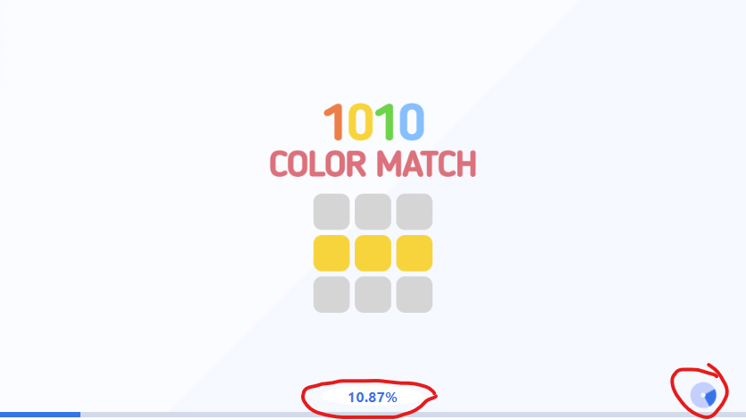

# HTML Loader for Defold

This extension adds a loading percentage with frame and a spinning circle in the corner. You can also change the background color and set the size for the splash image.



The circle will be hidden when the game is loaded.
You can show it again and add text with percentages. For example when you load resources with liveupdate.

```lua
function init(self)
    if html_loader then
        html_loader.show()
        html_loader.set_text("Loading")

        self.percent = 0
        timer.delay(0.2, true, function(self, handle, time_elapsed)
            self.percent = self.percent + 1
            html_loader.set_progress(self.percent)
            if self.percent == 100 then
                timer.cancel(handle)
                html_loader.hide()
            end
        end)  
    end
end
```

## The `game.project` Settings

You can set these **optional** settings in `game.project`.

```ini
[html_loader]
background_size = 80%
background_color = rgba(255,255,255,1)
loader_main_color = rgba(26, 114, 235, 1)
loader_additional_color = rgba(26, 114, 235, 0.2)
loader_frame_color = rgba(255, 255, 255, 1)
```

* `background_size` <kbd>string</kbd> _optional_ Overloads the splash image size value for ".canvas-app-canvas". None by default.
* `background_color` <kbd>string</kbd> _optional_ Overloads the background color value for ".canvas-app-canvas". None by default.
* `loader_main_color` <kbd>string</kbd> _optional_ The main color of the loader. Used in circle, progress bar and text. Default: **#1a72eb**
* `loader_additional_color` <kbd>string</kbd> _optional_ The additional color of the loader. Used in circle, progress bar. Default: **rgba(1, 1, 255, 0.2)**
* `loader_frame_color` <kbd>string</kbd> _optional_ Frame color around progress text. Default: **white**

## Credits

Made by [PotatoJam](https://github.com/potatojam).

### License

MIT license
